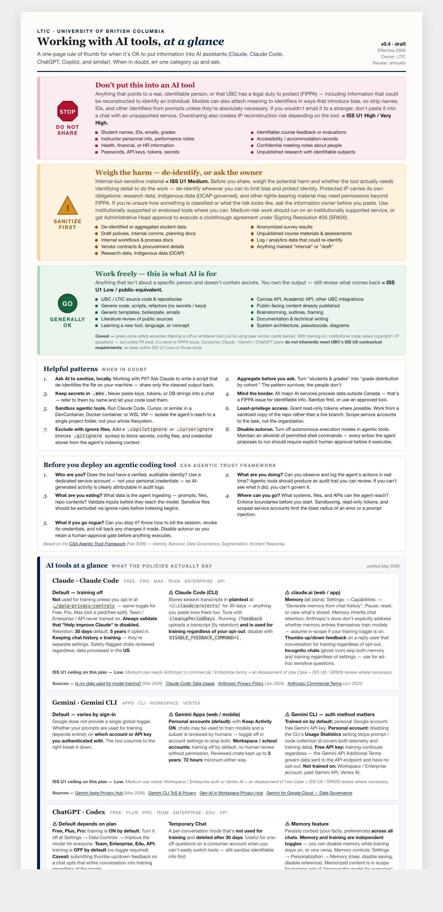

# LTIC — AI Tool Use, At a Glance

A printable policy reference for when it's OK to put information into AI
tools (Claude, Claude Code, ChatGPT, Copilot, etc.) when working at LTIC.
Page 1 is the at-a-glance summary (traffic-light rules + helpful patterns);
page 2 is vendor-specific facts (Claude, Gemini, ChatGPT) with source links.

Traffic-light zones and vendor cards reference UBC's
[Information Security Standards](https://cio.ubc.ca/information-security-standards):
**ISS U1** (data classification — Low / Medium / High / Very High) and
**ISS U9** (contractual controls for third-party services with Medium-risk data).
Keep these references current if Prism updates the framework.



## View it in your browser

This repo is private, so external rendering services won't work. To view:

1. Clone the repo: `git clone git@github.com:smolyn/ai_policy.git`
2. Open `ltic-ai-guidelines.html` in any browser (double-click works on macOS)

The page prints to two 8.5×11 sheets (File → Print).

## Edit

Everything lives in [`ltic-ai-guidelines.html`](ltic-ai-guidelines.html) — single self-contained file, no
build step. Open it in a browser to preview locally.

Common places to edit:

- **The three categories** — `<ul class="examples">` blocks (one per Red / Yellow / Green row)
- **The hint list** — `<ol class="tips">` block
- **Claude Code factual card** — `<section class="cc-card">` near the bottom
- **Stamp** (`v0.1 · draft`, owner, review cadence) — top-right of the header

## Refresh the preview image

After substantive edits, regenerate `ltic-ai-guidelines.png`:

```bash
"/Applications/Google Chrome.app/Contents/MacOS/Google Chrome" \
  --headless=new --disable-gpu --hide-scrollbars \
  --force-device-scale-factor=1.5 --window-size=900,1180 \
  --screenshot="$PWD/ltic-ai-guidelines.png" \
  "file://$PWD/ltic-ai-guidelines.html"
```
